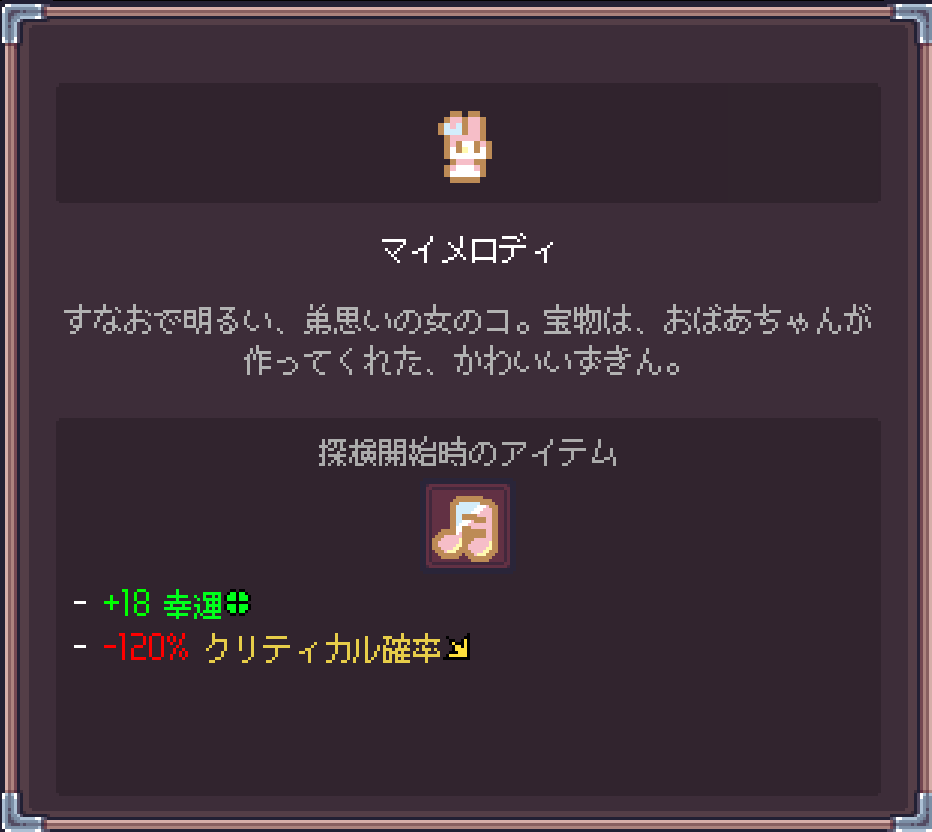
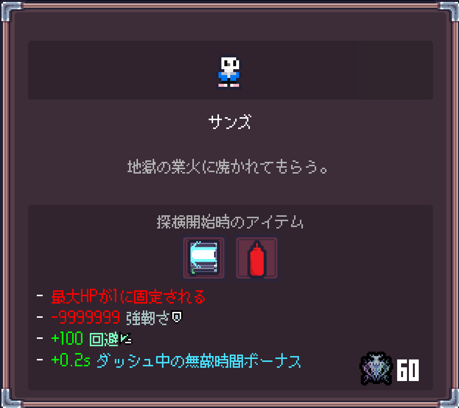
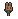
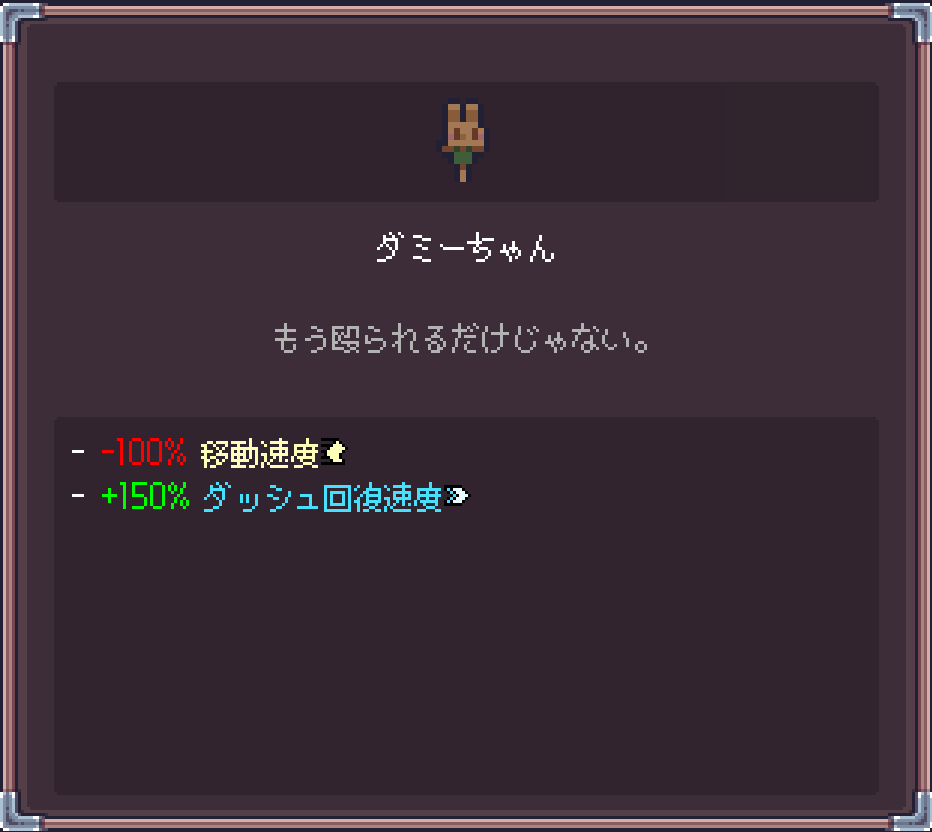

# Sephiria-ExtraCharacters

セフィリア用の新しいコスチュームをいくつか追加するMODです。
**今後のアップデートでさらに多くのコスチュームが追加される予定です**。

## 特徴

- セフィリアに新規コスチュームを追加
- 追加されるコスチュームは、それぞれ独自の新しい効果やアーティファクトを所持しています

## 追加キャラクター

現在、以下の3キャラクターが追加されています。

###  マイメロディ

###  サンズ

###  ダミーちゃん

## 導入方法
## ダウンロードするファイルについて

このMODは2種類のzipファイルを配布しています。お使いの環境に合わせてどちらか一方をダウンロードしてください。

- **ModMaker Runtimeが未導入の方** → `ExtraCharactersMOD-x.x.x-withRuntime.zip`（ModMaker Runtime同梱版）
- **すでにModMaker Runtimeを導入済みの方** → `ExtraCharactersMOD-x.x.x.zip`（Runtime非同梱版）

※ すでにRuntimeを導入している環境にFull版を入れると、ファイルが重複・競合する可能性があります。導入済みの方は必ずLite版をお使いください。

1. 本リポジトリの [Releases](../../releases) から、上記を参考に該当するzipファイルをダウンロード
2. zipを解凍
3. その中の `AddOns` フォルダを、`Sephiria.exe` と同じ階層に配置してください
   - すでに `AddOns` フォルダが存在する場合は、**上書き・統合**してください（フォルダごと置き換えるとほかのAddOnが消える可能性があるので、中身だけコピーするのがおすすめです）
4. ゲームを起動し、新しいコスチュームが追加されていることを確認してください

## 注意事項

- 本AddOnは新しいコスチュームを追加するものとなっており、既存のコスチュームや通常のゲームプレイに影響を及ぼすものは一切ございません。(例えば、新しいコスチュームには新しいアーティファクトを付与するものがありますが、それらのアーティファクトは通常プレイ時の報酬やショップでは出現しません)
- 本AddOnには `Sephiria` 本体のアセット・データは一切含まれていません。ゲーム本体は各自で正規に入手してください。
- 本AddOnは [Sephiria-ModMaker](https://github.com/Xetsumei/Sephiria-ModMaker/tree/main) を利用して作成されています。ModMaker自体の利用規約・ライセンスに従ってご利用ください。
- 導入は自己責任でお願いします

## 謝辞

本AddOnはXetsumeiさんが開発された**Sephiria-ModMaker**を利用して作成されています。
素晴らしいツールを公開してくださったXetsumeiさんに、心より感謝申し上げます！

## ライセンス

本AddOnのコード・設定ファイルは [MIT License](LICENSE) のもとで公開しています。
利用の際は本ライセンスの範囲内でお願いします。
