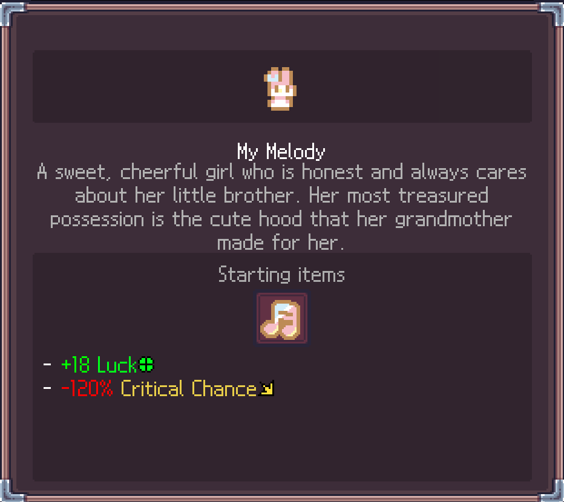
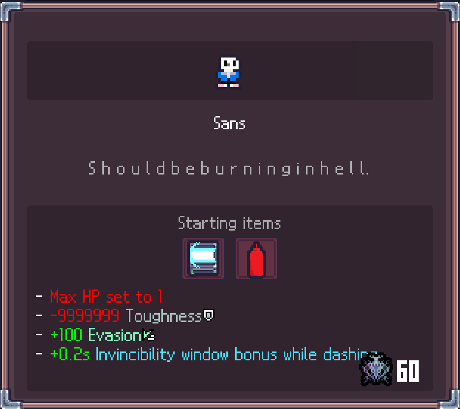
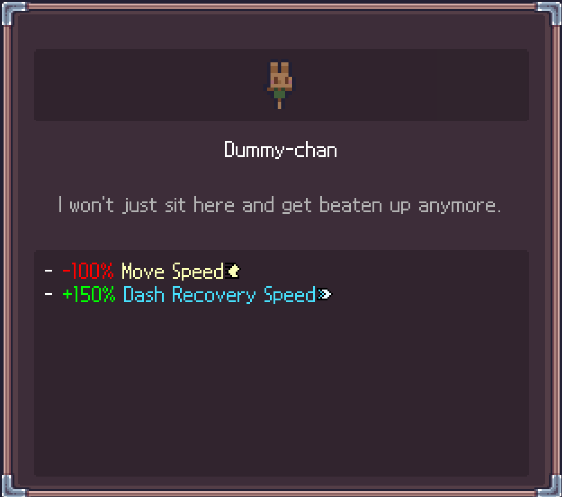

[日本語](README.ja.md) | **English** | [한국어](README.ko.md) | [中文](README.zh.md)
# Sephiria-ExtraCharacters

A mod that adds several new costumes for Sephiria.
**More costumes are planned to be added in future updates.**

## Features

* Adds new costumes to Sephiria
* Each added costume comes with its own unique effects and artifacts

## Added Characters

The following 3 characters are currently available.

###  My Melody

###  Sans

###  Dummy-chan

## Installation

### Which File Should You Download?

This mod is distributed as two different ZIP files. Please download the one that matches your environment.

* **If you do not have ModMaker Runtime installed** → `ExtraCharactersMOD-x.x.x-withRuntime.zip` (includes ModMaker Runtime)
* **If you already have ModMaker Runtime installed** → `ExtraCharactersMOD-x.x.x.zip` (does not include Runtime)

※ Installing the Full version on an environment where Runtime is already installed may cause file duplication or conflicts. If you already have Runtime installed, be sure to use the version without Runtime.

### Installation Steps

1. Download the appropriate ZIP file from [Releases](../../releases) according to the instructions above.
2. Extract the ZIP file.
3. Place the `AddOns` folder inside the extracted files at the same level as `Sephiria.exe`.

   * If an `AddOns` folder already exists, **merge/overwrite its contents**. Do not replace the entire folder, as this may delete other AddOns. We recommend copying only the contents of the folder.
4. Launch the game and check that the new costumes have been added.

## Notes

* This AddOn only adds new costumes and does not affect existing costumes or normal gameplay in any way. (For example, some new costumes grant new artifacts, but these artifacts will not appear as rewards or in shops during normal gameplay.)
* This AddOn does not contain any assets or data from the `Sephiria` game itself. Please obtain the game legally on your own.
* This AddOn was created using [Sephiria-ModMaker](https://github.com/Xetsumei/Sephiria-ModMaker/tree/main). Please use it in accordance with the terms of use and license of ModMaker itself.
* Use this AddOn at your own risk.

## Acknowledgements

This AddOn was created using **Sephiria-ModMaker**, developed by Xetsumei.
Many thanks to Xetsumei for creating and sharing such an excellent tool!

## License

The code and configuration files of this AddOn are released under the [MIT License](LICENSE).
Please use them within the scope permitted by this license.
